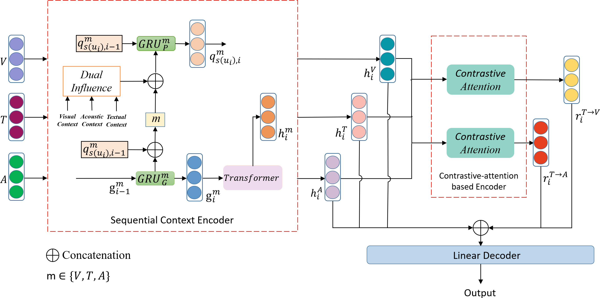

# Multi-modal Sarcasm Detection Based on Contrastive Attention Mechanism
 

| model | P | R | F1 |
|-|-|-|-|
| Two-attention-based encoder | 71.51 | 71.35 | 70.46 |
| GRU-based encoder | 71.69 | 70.90 | 70.82 |
| Sequential Context Encoder | 72.32 | 72.32 | 72.26 |
| ConAttSD | 74.46 | 74.01 | 73.97 |
